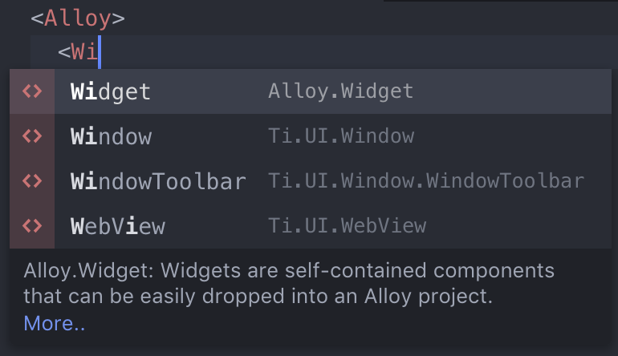
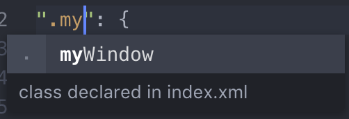
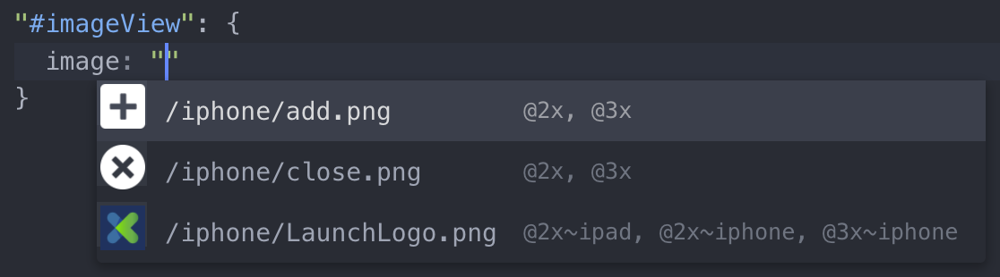
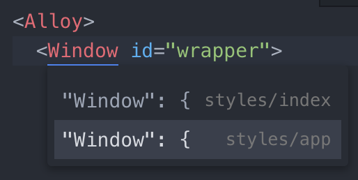
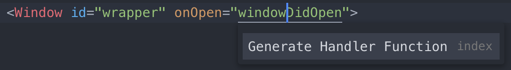

# Appcelerator Atom package

Appcelerator build tools and UI package for the Atom text editor.

### Atom

[Atom](https://atom.io) is an open source text editor built on [Electron](http://electron.atom.io) which provides a framework for building desktop apps for Mac, Windows and Linux using web technologies.

### Installation

While this is not in the public Atom package library you need to manually install it.

1. Clone or download the project and run from the project directory:

`npm install`

2. Copy or symlink the project directory into your Atom packagaes directory. For example:

`ln -s /path/to/the/plugin ~/.atom/packages`

3. Relaunch Atom

#### Dependency

Some of the features in this package are implemented as providers for services in the [Atom IDE](https://ide.atom.io) package. Install `atom-ide-ui` from the Atom package installer.

# Features

## Commands

Command                 | Description
---                     | ---
appc:build              | Build using the current selected command and configuration
appc:stop               | Stop the current build
appc:console            | Toggle the console
appc:generate           | Open a dialog to generate a new controller, creating Alloy XML, TSS and JavaScript files
appc:open view          | Open the related Alloy XML file
appc:open style         | Open the related Alloy TSS file
appc:open controller    | Open the related JavaScript file
appc:open close related | Toggle the related Alloy XML, TSS and Javascript files

## Build tools

TBD

## Auto-completion

Auto-completion support is provided to help speed up development by providing quick references to Titanium APIs and Alloy markup as well as references to modules, widgets and assets within your project.

### Titanium and Alloy

Titanium APIs and Alloy markup suggestions are provided in Titanium JavaScript and Alloy XML and TSS files. This includes classes, properties, methods and events. Where appropriate additional information is provided with a link to the online documentation. Deprecated properties are also indicated.

### Project references

Suggestions for other controllers, modules and widgets are presented when referencing through a Titanium function or Alloy markup.

### Class and ID references

Suggestions for classes and IDs declared or defined in related Alloy XML and TSS files are presented.

### Images

Image suggestions are presented where appropriate, including a thumbnail preview and information about the scaled versions available.

## Open related files

Opening related Alloy files is supported (see above commands list).

* From View, open related Style and/or Controller
* From Style, open related View and/or Controller
* From Controller, open related View and/or Style

## Jump-to-definition

Jump-to-definition support is provided for quickly accessing the definiion or usage of Alloy markup and to easily generate new definitions. Images can be opened directly from their path.

### Alloy

From Views, click through to style definitions for tags, classes and IDs, in related or global TSS. Click through to event definitions in the related controller.

A prompt is displayed to generate undefined styles or functions.

### Strings

Click on localised string references to jump to their definition. The option to generate undefined strings is provided.

### Images

Click on an image path to open the image in a new tab. For iOS, where multiple scaled images exist with the same name the first is opened (e.g. @2x).

# Contributions

This package would not be possible without support from the Titanium community. Auto-completion and grammar support provided by [Jong Eun Lee](https://github.com/yomybaby) through the [Titanium Alloy package](https://github.com/yomybaby/atom-titanium).

## Additional thanks

We doth our caps to:

* [Titanium-Build](https://github.com/HazemKhaled/Titanium-Build)
* [tool-bar](https://github.com/suda/tool-bar)
* [toolbar-basic](https://github.com/mattlovaglio/toolbar-basic)
