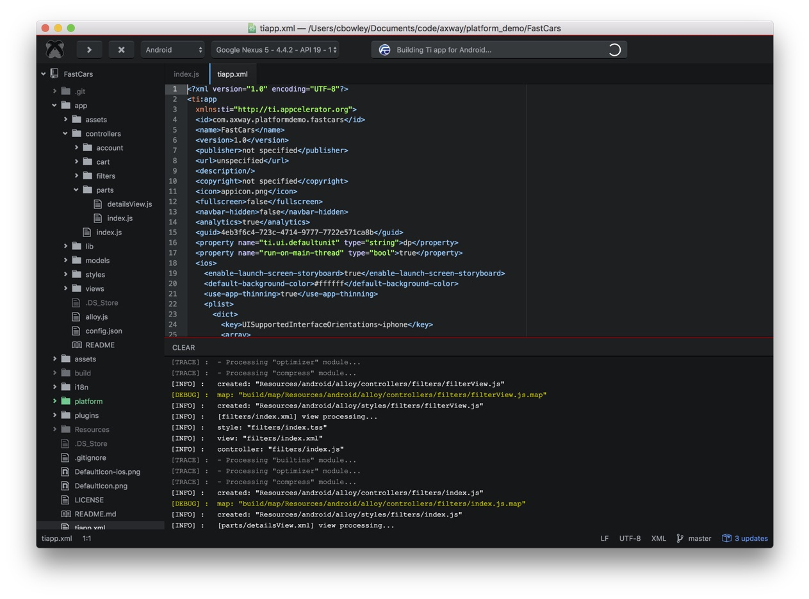

# Appcelerator Atom package

Appcelerator build tools and UI package for the Atom text editor.

### Atom

The [Atom text editor](https://atom.io) is built on [Electron](http://electron.atom.io) which provides a framework for building desktop apps for Mac, Windows and Linux using web technologies - Chromium, Node.js, HTML, CSS and JavaScript. Both Atom and Electron are open source.

### Credits

We doth our caps to:

* [Titanium-Build](https://github.com/HazemKhaled/Titanium-Build)
* [tool-bar](https://github.com/suda/tool-bar)
* [toolbar-basic](https://github.com/mattlovaglio/toolbar-basic)
